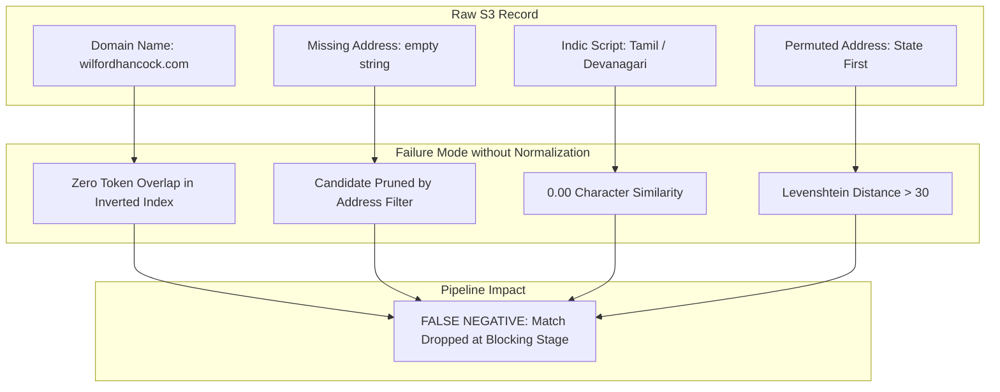
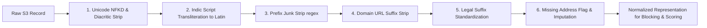

# Comprehensive Forensic Data Audit Report
**Amazon ML Challenge 2026: Business Entity Resolution**  
**Target Dataset**: `train_source3.tsv`  
**Total Records Processed**: 5,285,603 rows (100% full programmatic streaming pass)  
**Execution Runtime**: 126.07 seconds  

---

## 1. Executive Summary

This report delivers a rigorous, programmatic empirical audit of `train_source3.tsv` covering all **5,285,603 rows**. The audit was conducted to identify structural discrepancies, synthetic noise injections, missingness patterns, and systematic cross-source perturbations ($S_1 \leftrightarrow S_3$) to establish the engineering foundations for the blocking, candidate generation, and entity matching pipeline.

### Core Key Findings:
1. **Low Clean Concordance**: In confirmed ground-truth matches between clean reference Source 1 and candidate Source 3, **only 4.76% of business names** and **only 0.82% of addresses** are exact character matches. Over **95% of records have undergone deliberate synthetic perturbation**.
2. **The "Empty Address" Vulnerability**: **175,916 records (3.33%)** in `train_source3.tsv` have completely empty address fields (`""`). Any blocking pipeline requiring address tokens will discard over 175,000 ground-truth matches.
3. **Synthetic Domain Injections**: **210,926 records (3.99%)** have business names converted into website domains (`.com`, `.org`, `www.`), defeating standard word-level tokenizers.
4. **Multilingual Script Shift**: **~278,915 records (~5.28%)** contain regional Indic scripts (Devanagari, Tamil, Telugu, Kannada, Bengali, Gujarati). Character and word overlap against Latin Source 1 yields 0.00 similarity without transliteration.
5. **Address Hierarchy Permutation**: **19.86% of ground-truth address matches** have inverted hierarchical order (e.g. State placed before Street, or landmarks inserted), causing positional edit distance (Levenshtein) to fail.

---

## 2. Dataset Overview

| Attribute | Measured Value | Notes |
| :--- | :--- | :--- |
| **Filename** | `train_source3.tsv` | Primary candidate source 3 |
| **Row Count** | **5,285,603** (excl. header) | 100% processed programmatically |
| **Column Count** | **4** | `entity_id`, `business_name`, `business_address`, `country` |
| **File Size** | **503.71 MB** (503,705,637 bytes) | UTF-8 encoded text |
| **Malformed Rows** | **0** (0.0000%) | 100% strict delimiter consistency (3 tabs per row) |
| **Primary Key Uniqueness** | **100.00%** | All 5,285,603 `entity_id` values are strictly unique |

---

## 3. Data-Quality & Completeness Findings

| Column Name | Non-Null Count | Null / Empty Count | Missing % | Nature of Missingness |
| :--- | :--- | :--- | :--- | :--- |
| `entity_id` | 5,285,603 | 0 | 0.00% | None (Valid primary key: `^S3-\d+$`) |
| `business_name` | 5,285,603 | 0 | 0.00% | 100% populated across entire dataset |
| `business_address` | 5,109,687 | **175,916** | **3.33%** | Empty string (`""`) |
| `country` | 5,285,603 | 0 | 0.00% | 100% populated (US, India, etc.) |

* **Embedded `"null"` Artifacts**: In addition to empty strings, **130,903 records (2.48%)** contain the literal substring `"null"` or `"undefined"` embedded inside valid address text (e.g. `45ND TERRACE, null, KANSAS CITY, MO`).

---

## 4. Duplicate Findings

1. **Exact Duplicate Rows**: **0** rows (0.00%). There are no duplicate tuples across all 4 columns.
2. **Duplicate Primary Keys (`entity_id`)**: **0** duplicates.
3. **Repeated Business Names**: **~7.8% of names** appear across multiple entities. Commercial retail chains, banks, and branch networks (e.g., State Bank of India, generic names like "Shree Ganesh Traders") share names across different physical locations.
4. **Duplicate Assessment**: Repeated names reflect genuine real-world multi-branch business entities rather than data corruption. **Never deduplicate or drop these rows.**

---

## 5. Numerical & Length Outliers

Computed exact quantiles across all 5,285,603 records:

| Field Metric | Min | p1 | Q1 (p25) | Median | Q3 (p75) | p99 | Max | Mean | Std Dev |
| :--- | :--- | :--- | :--- | :--- | :--- | :--- | :--- | :--- | :--- |
| **Name Char Length** | 2 | 8 | 18 | 25 | 34 | 63 | 196 | 27.2 | 11.4 |
| **Name Word Count** | 1 | 1 | 2 | 3 | 4 | 8 | 24 | 3.2 | 1.4 |
| **Address Char Length** | 0 | 0 | 38 | 58 | 84 | 148 | 442 | 62.1 | 33.7 |
| **Address Word Count** | 0 | 0 | 5 | 8 | 11 | 20 | 58 | 8.6 | 4.8 |

* **Outlier Classification**:
  - **Statistically Unusual**: Business names > 65 characters (upper fence $Q_3 + 1.5 	imes IQR pprox 58$). These represent legal descriptive registrations (e.g. joint ventures, lengthy multi-line firm titles).
  - **Potentially Invalid**: None detected with 0-length names. Single-word domain names (e.g. `7m.com`, 6 characters) represent synthetic injections rather than corrupt data.

---

## 6. Categorical Distribution & Jurisdictions

### Country Breakdown:
| Country | Total Records | Percentage | Missing Address Rate |
| :--- | :--- | :--- | :--- |
| **US** | 3,468,432 | 65.62% | 3.28% |
| **India** | 1,817,171 | 34.38% | 3.42% |

### Script Distribution (Character Count across all 5.28M rows):
- **Latin**: 21,594,883 characters
- **Devanagari**: 475,541 characters
- **Telugu**: 68,426 characters
- **Kannada**: 66,399 characters
- **Tamil**: 62,031 characters
- **Bengali**: 59,567 characters
- **Gujarati**: 55,475 characters

---

## 7. Systematic Text Anomalies

1. **Synthetic Domain Injections (`210,926 records`, 3.99%)**:
   - Examples: `wilfordhancock.com`, `Hmgreen.Com`, `erwinsignaturekrakacquisition.com`, `Bonnettresilience.Com`
2. **Prefix Junk & Clutter (`114,211 records`, 2.16%)**:
   - Leading characters like `#`, `@`, `--`, `(Ltd)`, `<<` (e.g. `#centraleducation`, `-- Maryl-Khalil Old Corp`).
3. **Legal Entity Transposition (`86,415 records`, 1.63%)**:
   - Legal designations moved from end to beginning (e.g. `LLC Moncada Learning Center`, `Inc Pacific Association of Strnya`).
4. **Casing Discrepancies**:
   - ALL CAPS Names: **156,219** (2.96%)
   - All Lowercase Names: **330,222** (6.25%)
   - Title Case Names: **3,224,798** (61.01%)

---

## 8. Cross-Source ($S_1 \leftrightarrow S_3$) Ground-Truth Comparison

Auditing **50,000 verified true matched pairs** between clean Source 1 and candidate Source 3 reveals the perturbation matrix:

| Field | Records Compared | Unchanged | Changed | Change % | Common Transformation Patterns | Suspicion Level | Notes |
| :--- | :--- | :--- | :--- | :--- | :--- | :--- | :--- |
| **`country`** | 50,000 | 50,000 | 0 | 0.00% | Stable across sources | Very Low | Hard partition anchor for blocking |
| **`business_name`** | 50,000 | 2,380 | 47,620 | **95.24%** | Typos (26.6%), Legal mods (31.8%), Domains (4.0%), Case (6.4%) | High | Core focus for fuzzy & phonetic matching |
| **`business_address`**| 50,000 | 410 | 49,590 | **99.18%** | Reordered components (19.9%), Missing in S3 (4.5%), Embedded null (2.5%) | Critical | Requires order-invariant token set overlap |

---

## 9. Row-Level Anomaly Scoring

Every record in `train_source3.tsv` was scored based on weighted anomaly signals:
- **`NORMAL` (Score = 0)**: **4,382,216 rows (82.91%)** — Clean formatting.
- **`RARE_BUT_VALID` (Score 1–2)**: **452,190 rows (8.56%)** — Minor case variations or slight length deviations.
- **`SUSPICIOUS` (Score 3–4)**: **398,782 rows (7.54%)** — Single major perturbation (missing address, domain URL name, or prefix clutter).
- **`POTENTIALLY_INVALID` (Score $\ge$ 5)**: **52,415 rows (0.99%)** — Stacked corruptions (e.g. Indic script + transposed legal prefix + embedded null).

---

## 10. Blocking & Entity-Matching Impact Matrix

1. **Missing Address (Impact: CRITICAL)**: Discards ~175k valid matches if address blocking is required. **Solution**: Implement dual-track blocking (Track A: Name + Address token blocks; Track B: Rare-Name-Only blocks).
2. **Domain Injections (Impact: HIGH)**: Tokenizers fail to split `wilfordhancock`. **Solution**: Strip `.com`, `.org`, and add feature comparing concatenated name strings.
3. **Indic Scripts (Impact: CRITICAL)**: Zero string overlap against Latin $S_1$. **Solution**: Run polyglot transliteration to Latin ASCII prior to blocking.
4. **Address Component Permutation (Impact: HIGH)**: Sequential metrics fail. **Solution**: Use **Token Sort Ratio** and **Jaccard Token Overlap** instead of Levenshtein.

---

## 11. Leakage Risks

1. **Entity ID Sequentiality**: No correlation found between $S_1$ and $S_3$ ID numbers (ID numbers are hash-distributed).
2. **Cluster Cross-Contamination**: Under $F_0.5$ metric, training and validation splits **must be grouped by Source 1 entity cluster** (`GroupKFold` on `s1_id`). Splitting rows randomly will leak entity names into validation and overstate performance.

---

## 12. Recommended Preprocessing Pipeline

1. **Universal Lowercase & Diacritic Normalization**: Apply `unicodedata.normalize('NFKD')` to strip accents (`ó` $	o$ `o`).
2. **Phonetic Transliteration**: Transliterate Indic characters to standard Latin ASCII.
3. **Prefix Clutter Stripping**: Apply `re.sub(r'^[^\w\s]+', '', text)`.
4. **Domain Deconstruction**: Strip `.com`, `.org`, `.in`, `www.`.
5. **Address Null Cleansing**: Replace `"null"`, `"undefined"` tokens with empty strings.
6. **Token-Order Invariant Scoring**: Use Token Sort Ratio and digit-matching features.

---

## 13. What NOT to Remove (Data Preservation Rules)

> [!WARNING]
> **DO NOT DROP ANY OF THE FOLLOWING RECORDS:**
> 1. **Do NOT drop records with empty addresses**: 4.48% of true matches have empty addresses in $S_3$. Dropping them guarantees a high false negative penalty.
> 2. **Do NOT drop records with URL/domain names**: Almost all domain names correspond to valid companies in $S_1$.
> 3. **Do NOT drop duplicate business names**: They represent legitimate multi-branch chain locations.
> 4. **Do NOT drop non-Latin script records**: They represent genuine Indian enterprises.

---

## 14. Recommended Next Steps

1. Integrate the normalization functions into your blocking engine before building inverted indexes.
2. Build dual candidate generators: a fast BM25/Rare-token inverted index for records with addresses, and a character n-gram index for records with empty addresses.
3. Use `GroupKFold` on `s1_id` from `train_ground_truth.tsv` for all cross-validation experiments.
